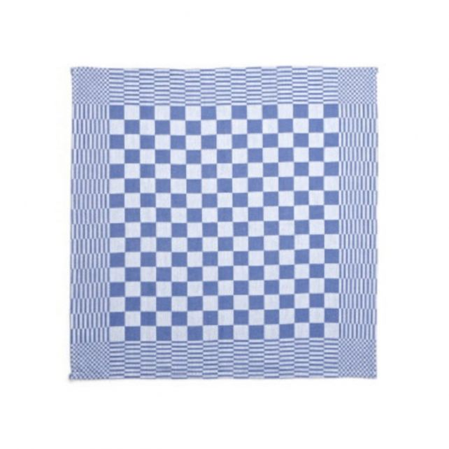
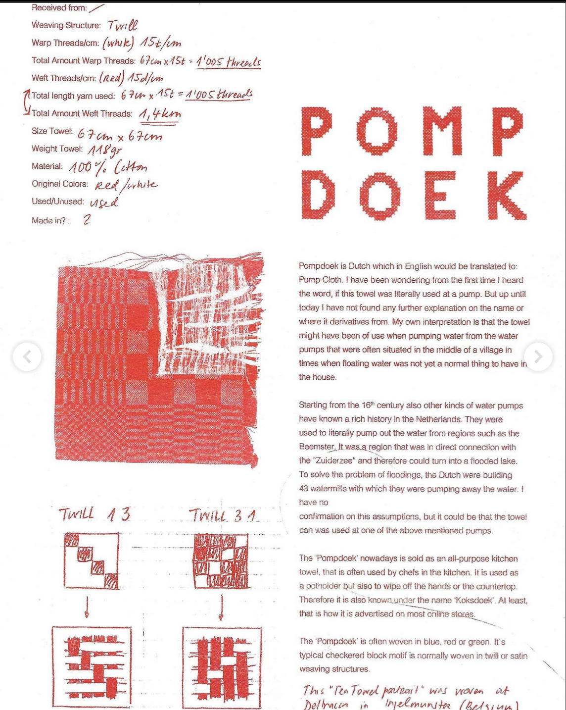
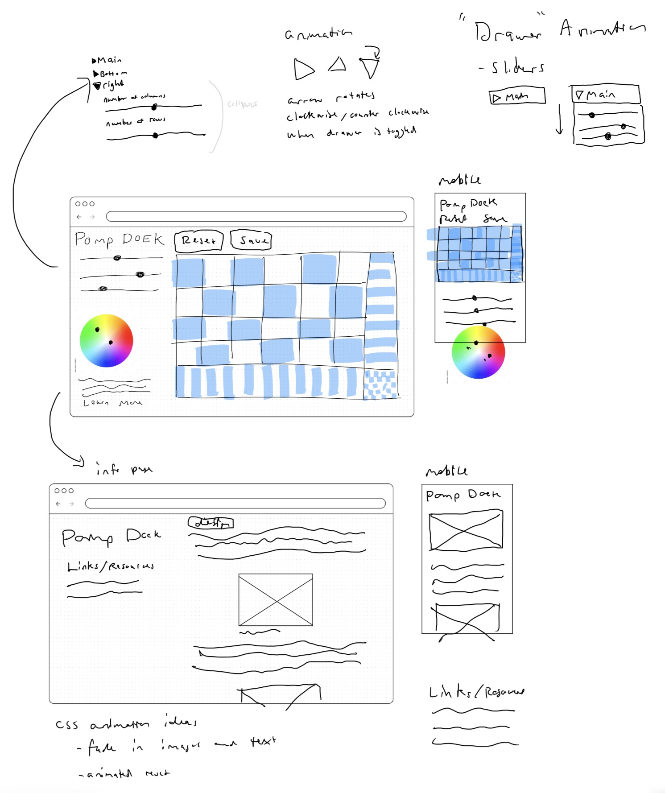
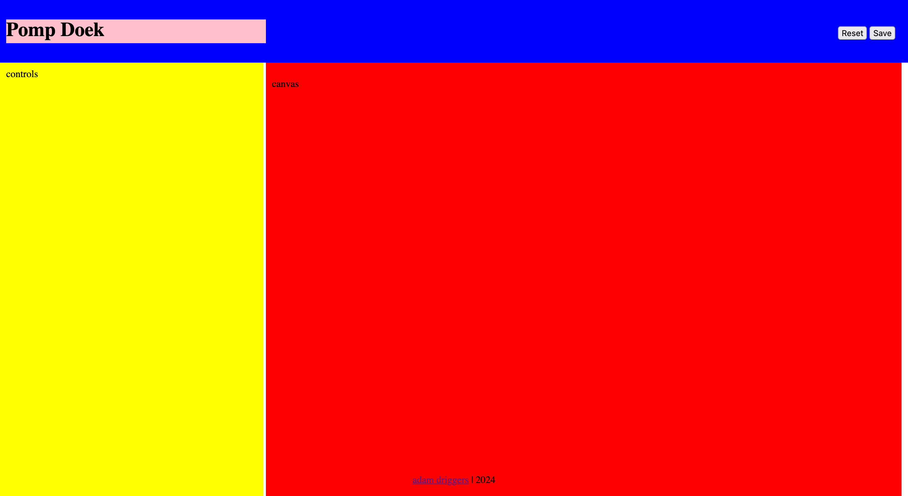
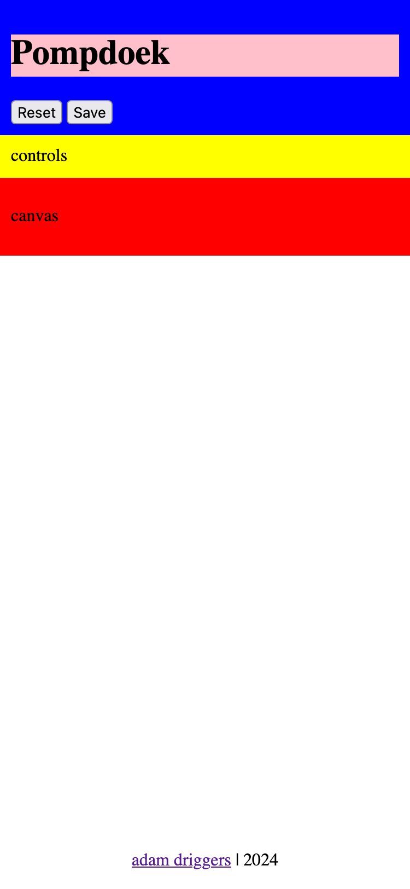

# Pompdoek

“Pump Towel”

On a visit to the Netherlands in April, a say a bartender with a kitchen towel with a cool geometric checker board design. The next day a saw the same towel in a shop window. I realized what I at first thought was a trendy designer textile was in fact a ubiquitous everyday item. 



Source: [https://www.tenkatetextiel.nl/pompdoek-blokdoek-dubbeldraads-dambord-blok](https://www.tenkatetextiel.nl/pompdoek-blokdoek-dubbeldraads-dambord-blok)

When I moved to the Netherlands a few weeks ago, I continued to see the same motif everywhere. I decided to dig in and doing little research on the design, but didn’t find any information that identified a designer or an original creator.

Upon a visit to the TextielMuseum Tilburg, I learned about the *Thread by Thread* project by textile artist Vera Roggli. In this project Roggli deconstructed common textiles to examine how they are made. Here I found out more about the history of the Pompdoek.



https://www.instagram.com/p/ClHwlHftSue/?img_index=3

I like the simplicity of the pattern and decided to recreate the pattern in p5.js as one of my daily sketches that I have been completing as part of sketch-a-day, adding an interactive slider that controls the fade timing.

[https://awdriggs.github.io/sketchaday/d09052024/index.html](https://awdriggs.github.io/sketchaday/d09052024/index.html)

I decided it would be great to allow a user to fully control the entire design and felt like having a simple user interface would be important. So I set out to make a simple page dedicated to this simple, everyday towel.

## Process

### Design and Layout

Starting with wireframes, I wanted to make the layout as straightforward as possible.



Wireframes

Before getting to much into the page styling, I like to add the structure the page in html and add css to get the layouts set before doing too much work on aesthetics. I use bold background colors on every element to see how the structure is behaving. I start with the mobile layout because it is the simplest then move to a desktop layout.



Desktop/Laptop Layout



Mobile Layout

### Responsive Canvas

I realized that the canvas would also need to be responsive and always fill the main section but should stay in the 16:9 proportion of the screen.

In setup, I started by grabbing the parent div from the html. I sued the width of the div for the width of the canvas and calculated the height in proportion to the width.

```jsx
function setup(){
  container = select('#canvas-wrapper');
  createCanvas(container.width, container.width * (9/16)); //keep hd proportions
}
```

Anytime the screen is resize, the canvas size would need to update too.

```jsx
function windowResized() {
  container = select('#canvas-wrapper'); //regrab the container to get the new width
  resizeCanvas(container.width, container.width * (9/16)); //keep hd proportions
}
```

I wanted to test this and linking an HTML slider to an variable in p5 in a simple sketch. I linked the size of the circle to a slider for testing.

```jsx
//in setup
 slider1 = select('#circ-size');
```

Then in draw I can set the circle size with the value from the slider.

```jsx
//in draw
  let s = slider1.value();
  ellipse(width/2, height/2, s, s);

```

I wanted to give the user the option to download their Pompdoek design so I attached a mouse event to the button that would call the `saveCanvas` p5 function whenever it was clicked.

```jsx
 //in setup
  saveButton = select('#save');
  saveButton.mousePressed(() => saveCanvas('pompdoek', 'png'));

```

Now anytime the save button is pressed the `saveCanvas` function is called. The syntax might look a little wonky. Here I’m using an arrow function to pass the `saveCanvas` function as a parameter to the mouse event.

Now I had a “minimal viable product” where the p5 sketch was living within the HTML layout and could be controlled by the input elements on the page.


### Styling

I next added more styling and Incorporated the tiling sketch, all the sliders for user input and two HTML5 color inputs to allow a user to select a primary and secondary color.


One thing I had to consider was how the slider minimum and maximum values would need to change as the canvas was resized. I thought it would be cumbersome to rebuild the html for the sliders with each canvas resize and I wanted the simplest solution possible. 

To that end I decided to make each slider go from 0 to 1, with a step size of 0.01. This is like treating the slider a percent. 

```html
<!-- example slider --> 
<input id="right-boundry" name="size" type="range" min="0" max="1.0" step="0.01" value="0.5" class="slider">

```

Then in p5 I could map the 0 to 1.0 value to the desired range for the current canvas size.

```jsx
let rightDiv = map(rightBoundrySlider.value(), 0, 1, 1, width); 
```

I wanted to have specific slider values when the sketch starter, as well as the ability of the user to reset the sliders to their original state. I created this function that would get called in setup as well as anytime the reset button was pressed.

```jsx
function resetControls() {
  console.log('reset');
  // slider1.elt.value = 0.2
  rightBoundrySlider.elt.value = 0.8;
  bottomBoundrySlider.elt.value = 0.66;
  mainW.elt.value = 0.2;
  cornerW.elt.value = 0.2;
  bottomW.elt.value = 0.7;
  bottomH.elt.value = 0.03;
  rightW.elt.value = 0.03;
  rightH.elt.value = 0.4;

  colorOneInput.elt.value = "#434f71"
  colorTwoInput.elt.value = "#FFFFFF"
}
```

See the [live site here!](https://awdriggs.github.io/pompdoek/)

And here is the [github repo](https://github.com/awdriggs/pompdoek/tree/main) with the code.